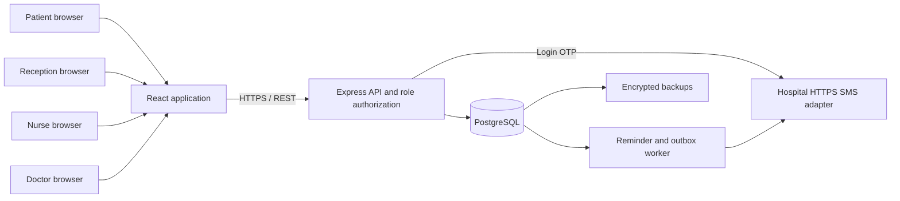

# Chettinad Care v2 architecture and operation

## Implemented system

The v2 application is built in this repository. It reuses the existing patient, user, encounter, note, prescription and authentication foundations and adds the connected outpatient workflow. The application entry point is `src/opd/App.tsx`; the v2 API lives in `backend/opd/`. Historical screens and API modules remain in the tree, but legacy clinical API routes require an explicit local-only switch.

The frontend uses React, TypeScript, React Query, React Hook Form and a shared English/Tamil/Telugu dictionary. The API uses Express, TypeScript, Zod validation and parameterized SQL. Node.js 24+ loads the backend TypeScript modules directly; `npm run check:backend` performs the separate static check. PostgreSQL is the deployment database. SQLite provides a single-process local demonstration and test environment.



The clinical database is authoritative. Queue screens refresh about every five seconds; records, laboratory views and operational data use periodic React Query refreshes, generally ten to fifteen seconds. Successful mutations invalidate affected queries. These are polling updates; v2 does not claim WebSocket or guaranteed instant push delivery. Network failures remain visible and failed clinical writes are not silently queued offline.

## Data and consistency

Migration `012_connected_opd` adds demographics/MRN/version fields and the departments, practitioner schedules, unavailability, appointments, token counters, queue entries, triage records, clinical versions, catalogues, laboratory orders/results, journey events, patient OTPs, notification and SMS outbox tables. Migration `013_session_and_encounter_integrity` enforces one active encounter per patient and separates public device-session IDs from stored refresh-credential hashes. It revokes older affected sessions, requiring those users to sign in again.

Registration creates demographics and an identity; booking creates an appointment. A verified reception check-in creates the encounter and department/day token. Booking and check-in are separate actions. Follow-ups are appointments whose `follow_up_of` links to the source encounter; there is no second disconnected follow-up record.

Schedule dates and times use `Asia/Kolkata`. Stored appointment timestamps are UTC ISO 8601 strings. Slots exclude breaks, leave and occupied intervals. Booking uses doctor and patient locks on PostgreSQL, overlap checks and unique indexes. SQLite transactions serialize local writes. A partial database index rejects multiple active encounters for one patient. The migration stops if legacy duplicates need attributed operator repair; it does not choose or delete clinical records.

The queue lifecycle is:

```text
WAITING → TRIAGE → WAITING_DOCTOR → DOCTOR_READY → CONSULTATION → COMPLETED
                                └────────────────→ CONSULTATION
```

Queue transitions, clinical updates and schedule/appointment changes use version checks. A stale `__v` returns `409 STALE_STATE`; the client must reload the resource before trying again. Check-in is idempotent for an already checked-in appointment. A doctor may have only one active consultation. Encounter completion validates the note, issues the prescription, books an optional follow-up and completes the queue/appointment in one transaction.

Triage and clinical amendments append attributed versions with reasons. Completed signed source notes and prescriptions remain intact. The record reader presents the latest authorized version alongside its history. Prescription validation metadata records author, issuance time and a SHA-256 digest; this is not a certificate-backed digital signature or an external prescribing integration.

## Identity, permissions and records

Patient login uses a normalized Indian mobile number and a cryptographically generated six-digit OTP, HMAC-hashed at rest. Codes expire after five minutes, are single-use, have an attempt limit, and enforce a resend interval and request rate limits. An unregistered verified mobile requires demographics before account creation. Mobile changes require a separate verified identity workflow and are rejected by the ordinary profile-update endpoint.

Staff use their own login endpoint and bcrypt password hashes. Newly provisioned staff must change their temporary password. Provisioning and password changes require 12–72 characters with uppercase, lowercase, a number and a symbol. The browser holds access tokens in memory, with rotating HttpOnly refresh cookies. Access JWTs carry role/account scope and a non-secret session identifier; refresh secrets are stored as hashes and are not returned by the device list. Staff deactivation and device-session revocation invalidate access through the session checks.

Browser sign-out clears local access immediately and records only a non-secret signed-out marker in local storage. If server revocation fails, the UI reports pending server sign-out and retries before restoring or starting another session. Other open tabs clear their session, and delayed refresh/session responses cannot restore access after sign-out. The server retains the HttpOnly refresh cookie on a revocation error so that cleanup can be retried; a successful logout invalidates both refresh and access credentials.

| Actor | Scope |
| --- | --- |
| Patient | Own appointments, queue, demographics, signed records and released results |
| Reception/Admin | Demographics, booking/check-in, operational queues, staff/configuration and laboratory operations; clinical record endpoint denied |
| Nurse | Active patients in the nurse's department queue; triage writes and authorized chart context |
| Doctor | Linked care records, assigned clinical writes, own queue and assigned result review |

The API authorizes access independently of visible navigation. Request and audit correlation IDs connect actions to their actor. The notification worker records a system actor, recipient access, attempts and outcomes without copying mobile numbers or medical content into its audit context. Operational logs must remain access-controlled; database audit rows and clinical versions are sensitive records.

Laboratory tests are ordered from the configured catalogue. Reception/Admin performs collection, processing and verified result entry; a release flag controls patient visibility. The assigned doctor explicitly reviews an available result. Each correction creates a result version with a reason. The current verification control is an attestation by the entering authorized administrator; a distinct second-person laboratory verifier and a dedicated laboratory role are not implemented.

## Notification delivery

Journey mutations create in-app notifications and selected nonclinical SMS events in the same database transaction. The server starts the worker after migrations. Each cycle queues one appointment or follow-up reminder for a confirmed appointment within the next 24 hours. A reminder's dedupe key includes its appointment and scheduled timestamp, allowing a fresh reminder after rescheduling. Before sending a reminder, the worker rechecks the appointment and skips cancelled, checked-in, completed, expired or superseded reminders.

Outbox claims are persisted with a two-minute lease. PostgreSQL uses `FOR UPDATE SKIP LOCKED` and SQLite serializes claims. A crashed worker's expired claim can be recovered. Failed attempts retry after one, two, four and eight minutes, with at most five attempts; exhausted rows become `FAILED`. A successful HTTP response from the adapter sets `SENT`, meaning **adapter accepted**, not proof of handset delivery.

Without a configured adapter, reminders still appear in-app and outbox rows remain pending. `OPD_DEMO_OTP=true` and `NODE_ENV=test` disable the default external SMS transport. `OPD_NOTIFICATION_WORKER=false` disables the background loop. Tests call a cycle with an injected fake sender; importing the server does not start the worker.

Configure the adapter through `SMS_WEBHOOK_URL` (HTTPS) and `SMS_WEBHOOK_TOKEN`. Its contract is:

```http
POST <SMS_WEBHOOK_URL>
Authorization: Bearer <SMS_WEBHOOK_TOKEN>
Content-Type: application/json
```

```json
{
  "phone": "+91XXXXXXXXXX",
  "template": "APPOINTMENT_REMINDER",
  "variables": {
    "delivery_id": "sms-generated-id",
    "scheduled_at": "2030-01-15T08:00:00.000Z"
  }
}
```

The adapter owns hospital-approved message templates and provider integration. Event notifications use an allowlist and send a delivery identifier; reminders additionally send the validated scheduled time. Diagnoses, medications, result values, patient names and arbitrary clinical event context are not forwarded. OTP requests use `PATIENT_LOGIN_OTP` with `code` and `expires_minutes`, sent directly so a failed delivery cannot leave a valid login code available.

The adapter must deduplicate `variables.delivery_id`: transport is at-least-once because a process can stop after provider acceptance but before committing `SENT`. OTP requests do not use the outbox. Provider delivery receipts, a dead-letter retry administration screen, WhatsApp integration, delivery preference/consent management and a provider-specific SMS account are not included. Failed rows and delivery audit outcomes are available in the database for authorized operations.

## Run and configure

The root README and `docs/V2_DEMO.md` describe the isolated complete local demo. Useful commands:

```sh
npm run demo:seed
npm run dev:demo
npm run build
npm run check:backend
npm run test:v2
```

`npm run demo:seed` uses a dedicated SQLite file and synthetic accounts; it refuses production or a nonlocal deployment profile. It writes through the real API and preserves progressed records on rerun. `npm run test:opd` uses an isolated temporary database unless explicitly pointed to a dedicated PostgreSQL test database with `OPD_TEST_POSTGRES=true`. Do not run fixture or acceptance tools against hospital data.

Production configuration is supplied through the process environment or a secret manager. The backend does not implicitly load `.env` files. At minimum:

| Variable | Deployment setting |
| --- | --- |
| `NODE_ENV` | `production` |
| `APP_ENV` | `restricted_web_pilot` |
| `DB_DIALECT` | `postgres` |
| `DATABASE_URL` | Dedicated PostgreSQL connection string |
| `DATABASE_SSL` | `true` for a remote database connection |
| `DATABASE_SSL_CA` | Optional private CA certificate in PEM, including escaped newlines if needed |
| `JWT_SECRET` | Cryptographically random secret, at least 32 characters |
| `CORS_ORIGIN` | Exact HTTPS frontend origin, or comma-separated HTTPS origins |
| `COOKIE_SECURE` | `true` |
| `COOKIE_SAME_SITE` | `lax` for same-site hosting; `none` with secure cookies for cross-site hosting |
| `SMS_WEBHOOK_URL` / `SMS_WEBHOOK_TOKEN` | Authenticated hospital SMS adapter |
| `BOOTSTRAP_ADMIN_ID` / `BOOTSTRAP_ADMIN_NAME` / `BOOTSTRAP_ADMIN_PASSWORD` | First admin provisioning, if no admin exists |
| `OPD_DEMO_OTP` / `PILOT_AUTH_BYPASS` / `ALLOW_SEED_RESET` | `false` |
| `ENABLE_LEGACY_API` | Disabled; legacy clinical routes are not enabled in locked deployment |
| `VITE_API_BASE_URL` | Build-time frontend API base, normally `/api/v1` or an HTTPS API URL |

Start the API with `npm --prefix backend start`; migrations run at startup. Build and serve `dist/` with SPA fallback. `/api/v1/ready` checks database/migration/admin readiness; `/api/v1/health` reports database and integrity status. `/api/v1/openapi.json` serves the OpenAPI contract. Readiness does not certify an SMS provider, backup system, encrypted disk or public TLS endpoint.

The database adapter enables certificate and hostname verification when TLS is enabled. URL SSL parameters cannot override that verification. Supply the database provider's CA when it is not publicly trusted. The bundled Compose PostgreSQL runs on a private container network with database TLS disabled; it is development infrastructure. Remote database traffic needs verified TLS. Do not expose PostgreSQL directly to the public network.

Terminate browser TLS at a managed HTTPS ingress or reverse proxy, forward the original protocol correctly and restrict direct backend access. The supplied Nginx configuration listens on HTTP port 80 and does not provision a certificate. A complete deployment must add HTTPS termination. Secure cookie and origin settings must match the public frontend.

The API currently trusts exactly one reverse-proxy hop. Login limits use Express's resolved client address, not the untrusted leftmost forwarded address. The proxy immediately in front of the API must overwrite or append the actual client address, and clients must not reach the API directly. Review this configuration for a different proxy topology before deployment.

## External readiness and current limits

Database files, clinical JSON and backups are not encrypted by application code. SQLite demo files are plaintext. Provision PostgreSQL with encrypted volumes/backups, controlled keys, restricted credentials and tested restore procedures before storing real clinical records. TLS protects transport and does not supply encryption at rest. Application-level field encryption and key rotation are not implemented.

The repository provides workflows and local acceptance coverage, not a running hospital SMS subscription, lab-system integration or hosted production environment. The deployed hospital must configure its own drug/diagnosis/test catalogues and approved content. Demo data is synthetic and is not a clinical reference catalogue.

Rate limiting is currently process-local. Before horizontal scaling, provide shared rate-limit/session-abuse controls and validate workload, database contention, retention and operational alerting. The durable notification claims can coordinate PostgreSQL workers, but that does not make every operational control distributed. Audit storage is database-backed rather than a separately managed tamper-evident archive.

File attachments, imaging uploads, external laboratory connectors, ABHA integration, billing, payments, family/dependent accounts and WhatsApp are outside this implementation. Patient mobile recovery and changes need an additional verified workflow. The app supports printing a prescription through the browser, but it does not supply a PKI signing service. No public deployment, SMS delivery receipt or encrypted storage setup is implied by a passing local build or acceptance test.
