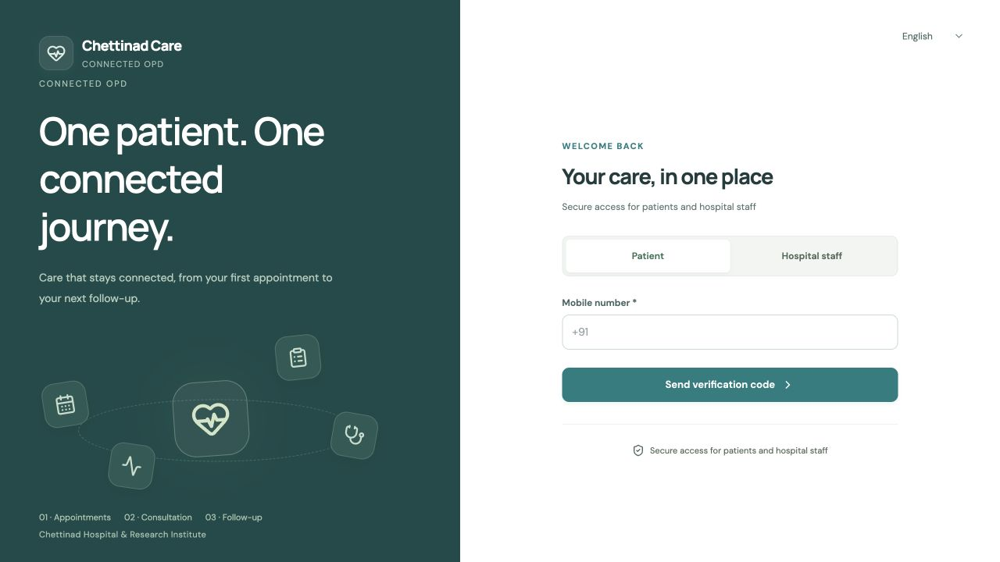

# Step 1 — clean installation and startup

Result: PASS for local installation and startup. This is not a hospital release approval.

Tested on 15 September 2026 with Node v24.15.0, npm 11.12.1 and macOS 26.6.2 arm64. Source was copied to a temporary project with node_modules, databases, builds, real environment files and Git history excluded. Original project databases were not copied or modified.

## Commands actually run

From the clean copy recorded in environment.json:

~~~sh
npm ci
npm --prefix backend ci
npm run build
npm run check:backend
npm run demo:seed
~~~

Both installs completed and reported zero known vulnerabilities. Frontend production build and backend type checking passed. All database migrations applied to a newly generated synthetic SQLite database.

The first seed attempt failed because the India clock was near midnight and insufficient slots remained that day. The seeder was fixed to book remaining scenarios on the next available day, report them as deferred, and leave them unchecked-in. It does not invent past clinical records. Retesting passed: six synthetic patients, four check-ins and two completed visits; three current-visit scenarios were honestly deferred to 16 September. Both the original failure and successful retest logs are retained.

## Startup actually run

Separate ports avoided pre-existing processes on 5173/3001:

~~~sh
PORT=3010 OPD_DEMO_OTP=true DB_DIALECT=sqlite SQLITE_PATH=connected-opd-demo.db npm run dev:backend
VITE_DEV_API_PROXY_TARGET=http://127.0.0.1:3010 npm run dev:frontend -- --host 127.0.0.1 --port 5180 --strictPort
~~~

Frontend: http://127.0.0.1:5180/
API: http://127.0.0.1:3010/api/v1

The actual browser displayed the login page. API health and public OTP configuration returned successfully. The unauthenticated initial refresh returned one expected 401, followed by the public login configuration response; startup did not loop.

## Warnings and limits

- Local startup warns about its development-only JWT secret fallback. This is expected in the documented synthetic demo; locked deployments require an explicit strong secret.
- Vite reports a 577 kB JavaScript chunk before gzip. Build passed; bundle optimization remains for the performance step.
- The backend install reports a deprecated prebuild-install dependency warning. Installation succeeded.
- SMS is intentionally unavailable in this local setup; no real messages were sent.
- Production PostgreSQL, TLS, encrypted storage, hosting and real SMS remain outside this startup check.
- Full browser workflows, security regression, print preview, localization and final release assessment have not been signed off by this step.

Evidence: environment.json, frontend-install.log, backend-install.log, build.log, backend-types.log, before-fix-late-night-seed.log, seed.log, backend-start.log, frontend-start.log, health.json and clean-start-login-pass.png.

The next step requires the user's confirmation, as requested.
